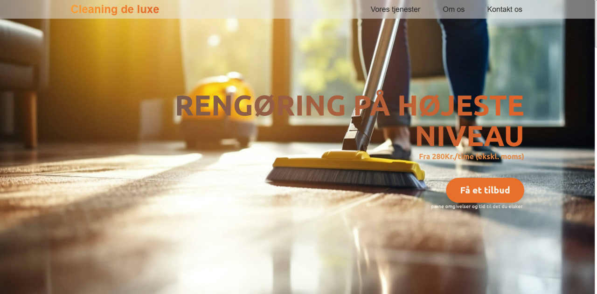
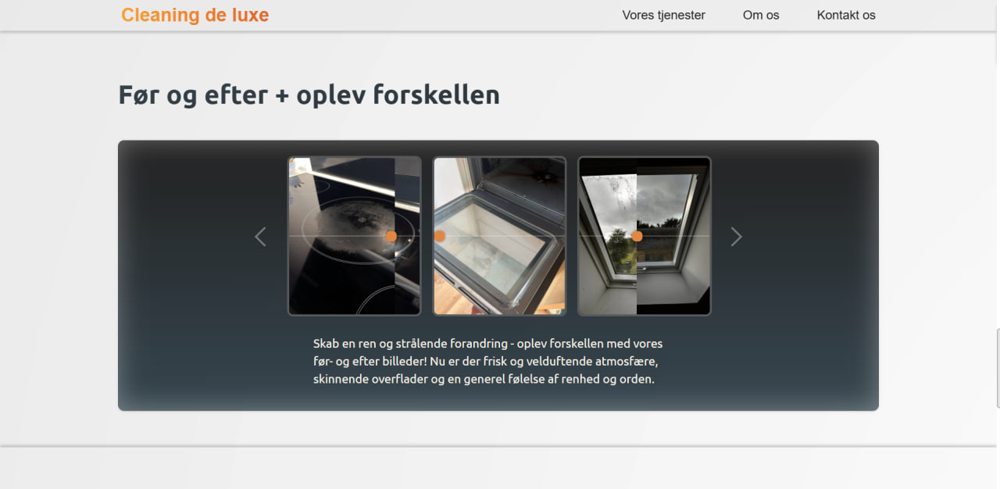

# 🧼 Cleaning Company Website (Denmark)

A modern, responsive website built from scratch for a Danish cleaning company. Includes interactive features and a sleek custom layout.

---

## 🔧 Features

- 🖼️ **Before/After slider** – draggable comparison of cleaning results
- 🎨 **Gradient animated text** – smooth color transitions
- 📱 **Responsive design** – mobile, tablet, and desktop friendly
- 📩 **Contact form** – sends data via fetch POST
- 📌 **Sticky header** – navigation remains at the top
- 🌍 **Deployed with custom domain and hosting**

---

## 🛠️ Tech Stack

- HTML5
- CSS3
- JavaScript (Vanilla)
- Git / GitHub

---

## ⚙️ Development Experience

This project was built completely from scratch without any ready-made design.  
I collaborated with a real Danish client, applied many revisions, and overcame challenges with language (Danish was translated via tools and often incorrectly).  
Deployment, domain setup, and hosting were done manually.

---

## 📸 Screenshots

  

---

## 🔗 Live Demo

[Visit Live Website](https://cleaningdeluxe.dk/)

---

## 🚀 Author

- 🇺🇦 Developer from Ukraine
- Looking for junior web development opportunities
- GitHub: [https://github.com/Tbhate]

---

---

# 🧽 Веб-сайт клининговой компании (Дания)

Современный адаптивный сайт, полностью разработанный с нуля для клининговой компании из Дании.

---

## 🔧 Основные возможности

- 🖼️ **Слайдер "до/после"** – сравнение результатов чистки
- 🎨 **Переливающийся градиент на тексте**
- 📱 **Адаптивный дизайн** – для телефонов, планшетов, ПК
- 📩 **Форма обратной связи** – отправка через fetch
- 📌 **Фиксированная навигация (header)**
- 🌍 **Установка хостинга и домена вручную**

---

## 🛠️ Стек технологий

- HTML5  
- CSS3  
- JavaScript  
- Git / GitHub  

---

## ⚙️ Опыт разработки

Проект делался без готового дизайна. Всё с нуля.  
Работал с настоящим клиентом из Дании, делал правки, часто переводил с датского (было сложно из-за кривого перевода).  
Разворачивал сайт вручную, сам настраивал домен и хостинг.

---

## 📸 Скриншоты

  

---

## 🔗 Ссылка на сайт

[Посетить сайт](https://cleaningdeluxe.dk/)

---

## 🚀 Автор

- 🇺🇦 Разработчик из Украины  
- Ищу стажировку или позицию Junior Frontend  
- GitHub: [https://github.com/Tbhate]
